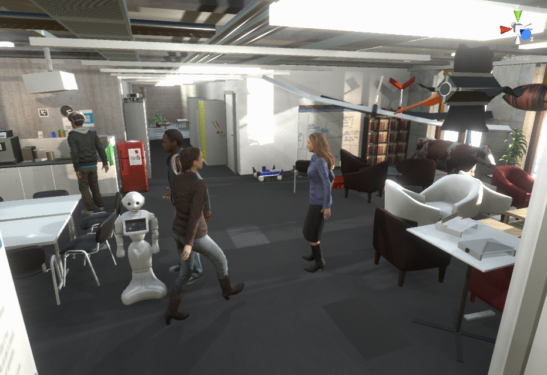

Project Unity version: 2021.1.25f1

# Installing Unity on Ubuntu

- (Ubuntu 18.04) Install blender 2.9
```
sudo add-apt-repository ppa:thomas-schiex/blender
```
- Download Unity Hub from [here](https://unity3d.com/get-unity/download), [direct link](https://public-cdn.cloud.unity3d.com/hub/prod/UnityHub.AppImage)
- From the [unity archive](https://unity3d.com/get-unity/download/archive), Find the version you want, right click the green button "Unity Hub", and copy the link. Then, open the link in unity hub like so:
```
chmod +x ~/Downloads/UnityHub.AppImage
~/Downloads/UnityHub.AppImage unityhub://2021.1.25f1/b6f2b893ea32
```

# Opening the Project in Unity

- make sure to clone with --recursive
- (to be fixed) Make sure blender ver >2.9 is installed before opening the project or unity will fail to import some 3D models.
- (to be fixed) `git clone git@github.com:Unity-Technologies/ml-agents.git` next to the `NavDreamsUnity` folder
- (to be fixed) after cloning, ensure `NavDreamsUnity/Assets/AddOns/Microsoft-Rocketbox` points to remote `git@github.com:danieldugas/Microsoft-Rocketbox.git`, branch **waveenv**
- open the project in unity (run the `UnityHub.AppImage` executable and select the project folder).
- open `Assets/Scenes/KozeHD.unity` and press play



# More How-Tos

- [Creating your own scene](wiki/custom_scene.md)
- [Adding your own robot](wiki/custom_robot.md)

